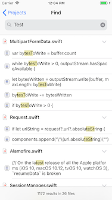

# FindKit

[](https://opensource.org/licenses/MIT)



**FindKit** is a framework and sample app that implements Full-Text Search of source code with Swift using Realm

- [Features](#Features)
- [Getting Started](#getting-started)
    - [Requirements](#requirements)
    - [Installation](#installation)
- [Usage](#usage)
    - [Initialization](#initialization)
    - [Create Index](#create-index)
    - [Find Matches](#find-matches)
- [Author](#author)
- [License](#license)
- [Acknowledgments](#acknowledgments)

## Features
- [x] Full-Text Search of iOS sources.

## Getting Started

### Requirements

* iOS 11.0+
* Xcode 10.0+
* Swift 4.2+

### Installation

**[Cocoa Pods](https://cocoapods.org)**

```sh
pod "FindKit", :git => 'git@github.com:watanabetoshinori/FindKit.git'
```

## Usage

### Initialization

Start by importing the package in the file you want to use it.

```swift
import FindKit
```

### Create Index

```swift
let index = FKIndex(name: "IndexName")

let document = FKDocument.create(from: "/Documents/Project/Source.swift")

let _ = self.index.add(document: document)

```

### Find Matches

```swift
let index = FKIndex(name: "IndexName")

let search = FKSearch(query: "viewDidLoad")
        
index.findMatches(with: search) { (documents) in
	// documents is array of FKDocument
}
```

Please refer to the [Example](Example) folder for more details about usage.

## Author

Watanabe Toshinori – toshinori_watanabe@tiny.blue

## License

This project is licensed under the MIT License. See the [LICENSE](LICENSE) file for details.

## Acknowledgments

This framework makes use of the following third party libraries:

*  [Realm](https://realm.io)
